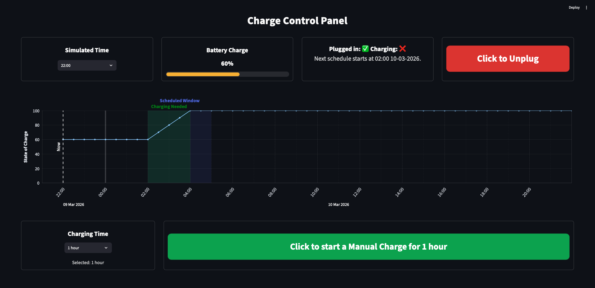

# EV Charge Control Panel



This project implements a **charge control panel** for an electric
vehicle charging application. The interface allows users to:

-   View their current battery state
-   See when charging is scheduled to occur
-   Override the schedule to charge immediately
-   Stop charging when needed

The application is built using **Streamlit** and simulates the behaviour
of an EV charging system.

------------------------------------------------------------------------

# Running the Application

Requirements

- Docker
- Python 3.11+ (if running locally)

Start the application with:

``` bash
docker compose up
```

Then open:

http://localhost:8501

------------------------------------------------------------------------

# Architecture Overview

The backend uses an **event-based simulation model**, where manual charge
events and schedule pause events are recorded and replayed to reconstruct
battery state deterministically.

The project separates responsibilities across several modules:

| Module | Responsibility |
|------|------|
| `app.py` | Application entrypoint and page layout |
| `backend.py` | Core charging simulation logic |
| `models.py` | Dataclasses representing system state |
| `plotting.py` | Charging schedule visualisation |
| `utils.py` | Utility functions |
| `ui/` | Streamlit UI components and styling |
| `state/` | Session state and persistence |
| `domain/` | Domain logic such as schedule rules |

The backend simulates charging behaviour based on:

-   scheduled charging windows
-   manual override events
-   the vehicle's current state of charge

This simulated state is then visualised in the frontend.

To reset the simulation, refresh the webpage.

------------------------------------------------------------------------

# Frontend Design Decisions

## Overview

A **dashboard layout** for the charge control panel was chosen so that all
relevant information is visible at once. This avoids hiding
functionality behind sidebars and allows users to quickly understand the
current charging state and take action.

The screen is divided into **three vertical sections**:

1.  **Metrics and simulation controls**
2.  **Charging schedule visualisation**
3.  **Manual charging controls**

This layout follows a natural user workflow:

1.  Configure the simulation parameters\
2.  Observe the resulting charging behaviour\
3.  Take action if necessary (start or stop charging)

------------------------------------------------------------------------

# Section 1: Metrics and Simulation Controls

The first section contains **four tiles**, arranged left-to-right, each
displaying a distinct piece of information.

Separating these into tiles helps users **quickly scan and
compartmentalise information**.

### 1. Simulated Time Selection

Users can select a simulated time of day using a **dropdown menu**.
The dropdown increments in 30 minute intervals.

The dropdown dynamically updates as time progresses. For example:

-   If the current simulated time is **14:30**
-   And the user selects **15:30**

The backend recalculates the vehicle's charging state and the dropdown
updates so the **next selectable time begins at 16:00**.

This ensures users always move **forward through simulated time**,
avoiding confusing backward state changes.

------------------------------------------------------------------------

### 2. Battery State

The battery state is displayed using:

-   A **percentage value**
-   A **visual charge bar**

A graphical charge bar improves usability because users can **quickly
understand battery state without reading numeric values**.

------------------------------------------------------------------------

### 3. Plugged-In and Charging Status

This tile communicates two key pieces of information:

-   Whether the **vehicle is plugged in**
-   Whether the **vehicle is currently charging**

Providing both statuses ensures users understand **why charging may or
may not be occurring**.

For example:

-   The car may not be charging because it is **not plugged in**
-   Or because **charging is not scheduled at the current time**

------------------------------------------------------------------------

### 4. Plug / Unplug Control

Users can toggle the vehicle connection using a **single button**.

A button was chosen instead of a toggle because it is simpler to
implement in Streamlit while remaining clear and interactive.

The button:

-   Changes **text dynamically** ("Plug In" / "Unplug")
-   Uses **colour cues**:
    -   Green → start action
    -   Red → stop action

Using a single button prevents users from seeing both options
simultaneously and reduces the likelihood of **accidental repeated
clicks**.

If implemented in a production system using a full frontend framework
(e.g. React), a **toggle component** may provide a more natural
interaction.

------------------------------------------------------------------------

# Section 2: Charging Schedule Graph

The second section visualises the vehicle's charging schedule using a
**24-hour timeline**.

Given the assumption of a **fixed daily charging window**, a 24-hour
view provides sufficient context while remaining easy to interpret.

The graph shows:

-   **State of charge over time**
-   The **scheduled charging window**
-   When charging is **actually required**
-   A **vertical "Now" marker**
-   A **midnight marker** to improve readability
-   The **date of the schedule**

The axes are defined as:

-   **Y-axis:** Battery state of charge (0--100%)
-   **X-axis:**
    -   `current_time - 30 minutes`\
    -   `current_time + 24 hours`

This framing makes the **current time marker more prominent** and gives
users context about both recent and upcoming charging activity.

Although the scheduled window runs **02:00--05:00**, the vehicle may not
require the full period depending on the current state of charge.

Therefore the graph shows:

-   The **full scheduled window**
-   The **actual charging period required**

This helps users understand how the schedule interacts with the
battery's current state.

If the application supported **multiple user-defined schedules**, a
**scrollable or multi-day timeline** would be preferable.

------------------------------------------------------------------------

# Section 3: Manual Charging Controls

The final section allows users to **override the schedule and manually
start or stop charging**.

Users can:

-   Select a **manual charge duration**
-   Start or stop charging immediately

The manual charge duration defaults to **1 hour**, but can be adjusted
using a dropdown.

The main action button dynamically updates based on the charging state:

  State          Button Action
  -------------- ---------------------
  Not charging   Start manual charge
  Charging       Stop charging
  Fully charged  No action - "Battery already full" message

As with the plug control, the button uses **colour cues**:

-   **Green** → Start charging
-   **Red** → Stop charging

This ensures the interface communicates the **available action clearly
at all times**.

------------------------------------------------------------------------

# Frontend Design Considerations

### User clarity over feature density

The interface prioritises showing a small amount of high-value
information rather than exposing every internal state variable. This
keeps the interface approachable for end users who may not be
technically inclined.

### Separation between system behaviour and user control

The UI clearly distinguishes between:

-   **Scheduled charging behaviour**
-   **Manual user overrides**

This helps users understand when the system is acting automatically
versus when they have intervened.

### Immediate visual feedback

User actions such as starting or stopping a charge immediately update
the graph and battery state. This reduces uncertainty and reinforces the
relationship between user actions and system behaviour.

### Scalability considerations

Although the current implementation assumes a single daily charging
schedule, the graph and state simulation logic were structured so that
additional schedules or optimisation logic could be added later without
significantly changing the UI.

------------------------------------------------------------------------

# Backend Functionality Overview

This section summarises how the backend of the EV charging control
panel works.

The backend simulates the behaviour of an electric vehicle charging
system and provides the data required by the frontend to display
charging schedules, battery state, and charging controls.

The charging behaviour is persisted, so that users can 
start and stop multiple manual charges, stop any scheduled
charges and progress forward in time to see the effects
of those charges.

------------------------------------------------------------------------

# Backend Responsibilities

The backend is responsible for:

-   Simulating the **battery state of charge (SOC)** over time
-   Determining **whether the vehicle should be charging**
-   Handling **manual charge overrides**
-   Handling **schedule pauses**
-   Generating **future charge states for visualisation**
-   Persisting state between UI interactions using **Streamlit session
    state**

The backend therefore acts as a **simple charging simulator and state
engine**.

------------------------------------------------------------------------

# Core Concepts

## State of Charge (SOC)

The battery state of charge is represented as a value between:

    0.0 → empty
    1.0 → full

Charging increases the SOC at a constant rate defined in the
configuration.

Example:

    CHARGE_RATE_PER_HOUR = 0.20

This means the battery gains **20% charge per hour**.

------------------------------------------------------------------------

# Scheduled Charging

The simulated vehicle follows a fixed daily charging schedule.

    SCHEDULE_START = 02:00
    SCHEDULE_END   = 05:00

If the vehicle:

-   is **plugged in**
-   is **not already full**
-   and the schedule is **not paused**

then the backend will simulate charging during this window.

------------------------------------------------------------------------

# Manual Charging Overrides

Users can override the scheduled behaviour by starting a **manual
charge**.

Manual charges:

-   start immediately
-   last for a **user-selected duration**
-   take precedence over scheduled charging

Manual charges are stored as:

    ManualChargeEvent

Each event records:

    start time
    end time

During this time window the backend forces the charger state to:

    car_is_charging = True
    charge_is_override = True

------------------------------------------------------------------------

# Stopping Charging

When the user presses **Stop Charging**, the behaviour depends on the
current charging type.

### If manual charging is active

The manual charge event is **truncated**, ending immediately.

The system then returns to normal scheduled behaviour.


### If scheduled charging is active

The schedule is **paused until the next morning**.

This is implemented by creating a:

    SchedulePauseEvent

The event prevents scheduled charging from occurring until the next
daily cycle.

------------------------------------------------------------------------

# Charging Simulation

The backend simulates charging in **30 minute increments**.

    PLOT_STEP = 30 minutes

For each time step the backend:

1.  Determines whether the car **should be charging**
2.  Calculates the **charge added during that time step**
3.  Updates the **battery state of charge**

This process is used both for:

-   updating the **current state**
-   generating **future predictions**

------------------------------------------------------------------------

# State Reconstruction

Instead of mutating state over time, the backend **rebuilds the battery
state from a base time** whenever the UI updates.

This ensures:

-   deterministic behaviour
-   consistent state even when the user jumps forward in simulated time

The rebuild process:

1.  Starts from the **initial SOC**
2.  Replays all **charging intervals**
3.  Applies **manual charge events**
4.  Applies **schedule pause events**
5.  Calculates the resulting SOC

------------------------------------------------------------------------

# Future State Simulation

To draw the charge graph, the backend simulates future states over a
**24 hour horizon**.

    PLOT_HORIZON = 24 hours

The backend repeatedly:

    calculate charger state
    apply charging logic
    advance time by 30 minutes

Each result is stored as:

    CombinedState

which contains:

    timestamp
    state of charge
    charger state

These states are then passed to the plotting module to generate the
graph.

------------------------------------------------------------------------

# Event-Based Design

Charging behaviour is influenced by two event types.

### Manual Charge Events

    ManualChargeEvent

Represents a temporary user override.


### Schedule Pause Events

    SchedulePauseEvent

Represents a temporary suspension of scheduled charging.


Using event lists allows the backend to **replay system history
deterministically** when reconstructing the battery state.

------------------------------------------------------------------------

# Session State Persistence

The application uses **Streamlit session state** to persist backend data
between user interactions.

The following values are stored:

    manual charge duration
    manual charge events
    schedule pause events
    backend state snapshot
    simulation time
    vehicle plug state

This allows the UI to behave like a persistent application even though
Streamlit reruns the script on every interaction.

------------------------------------------------------------------------
# Summary

The backend acts as a **deterministic charging simulator**.

Its responsibilities include:

-   tracking battery state
-   enforcing scheduled charging rules
-   handling manual user overrides
-   handling schedule pauses
-   predicting future charge behaviour

By rebuilding state from recorded events, the system ensures that
**charging behaviour remains consistent regardless of how the user moves
through simulated time**.

------------------------------------------------------------------------

# Assumptions

Several assumptions were made to simplify the implementation:

-   The vehicle begins with a **60% state of charge**
-   Charging occurs at a **constant rate**
-   Battery charge dissipation is **not a factor**
-   The scheduled charging window is **02:00--05:00 daily**
-   Charging behaviour is simulated rather than connected to a real
    vehicle API

These assumptions allow focus on **visualising and controlling 
charging behaviour**, which is the primary goal of the
exercise.

------------------------------------------------------------------------

# Future Improvements

If this were developed further, potential improvements include:

-   Adding **unit tests for charging logic and event handling**
-   Supporting **multiple configurable charging schedules**
-   Allowing users to **view multi-day charging forecasts**
-   Replacing Streamlit controls with a **React frontend** for richer
    interaction
-   Integrating with **real vehicle APIs**
-   Modelling real charging patterns
-   Modelling real battery charge dissipation

------------------------------------------------------------------------